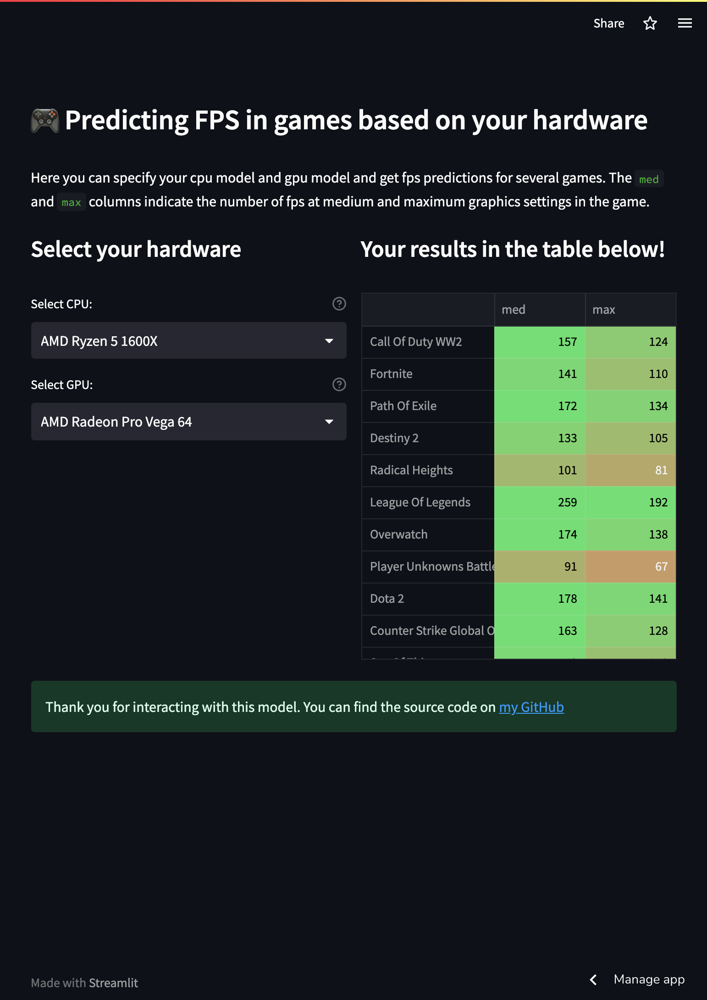

## 🎮 Predicting FPS in games based on your hardware
### Description
FPS prediction model designed for 
deployment on streamlit.  

You can find data processing and model development in the notebook.ipynb file.   
You can interact with deployed model [on streamlit 👾](https://fpsgames.streamlit.app/)
### References
Data source is [openml.org](https://www.openml.org/search?type=data&sort=runs&id=42737&status=active)
### Screenshot of the streamlit app

